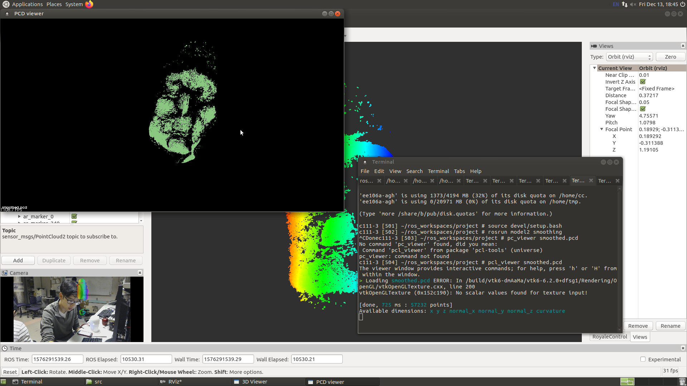

# Introduction

## What is soft tactile sensing?
Soft Sensing is an emerging field in robotics related to the design of robotics sensors that deform elastically when interacting with the physical environment. For our project, we were given access to a soft tactile sensor made by Isabella Huang, which provided point cloud data which, when analyzed, allowed for force, pressure, and topographical measurements on an object.

## Why is it useful?
We believed that for measuring the shape and surface of an object, this type of soft tactile sensing offers many advantages compared to traditional sensing techniques. For one, it allows for much more detailed readings compared to traditional vision, which can often be unreliable and overly dependent on the environmental factors. It also allows for a softer approach to more delicate tasks, such as interacting with people or handling breakable objects. 

## What is the goal of our project?
The goal of our project is to leverage those advantages and develop a system that takes in repeated measurements from the soft tactile sensor to generate a point cloud reconstruction of the surface of an object. This point cloud data could then be used for further analysis beyond surface reconstruction, such as for example, object or facial recognition (if the sensor is used to reconstruct the surface of a human face). 

# Design

## Criteria
The original goal of our project was to use a robot (preferably a Sawyer, due to its more accurate movement) with the STS (Soft Tactile Sensor) attached to the end effector to gather point cloud measurements one at a time, gradually building up a visualization of the entire surface of the object. This not only allows for more accurate readings of the transform between the global reference frame and the sensor itself (data that is needed to accurately build up a visualization of the object, as described in the Implementation section), but also allows for a more stable and consistent measuring process. 

## Our Final Design
Our final design, unfortunately did not leverage robotic control of the sensor. It involved a person holding the STS and moving it around gathering measurements of the object by hand, gradually building up a visualization of the object in only one viewing angle.

## Decisions, Tradeoffs, and their Impacts
Unfortunately, we were unable to use a Sawyer robot to manipulate the STS. Using a robot would have allowed for a more consistent measuring process and more accurate transform readings between the global frame and the STS. However, as a final test, we wanted to try measuring the surface of a human face, in which case, the use of a robot would be unnecessarily dangerous. Nevertheless, not using a robot in the measurement gathering process allowed for other advantages. With the flexibility of this measurements process we were also able to fine tune and add additional measurements in sparse areas of the final point cloud visualization if we deemed it necessary. Additionally, not having to deal with the actuation of the robot allowed for extra time working on the software portion of the project (documented in the Implementation section of the website).

However, not working with the Sawyer also meant we would have to gather transform data on the sensor using other methods. We decided that the best way to accomplish this was to attach an Augmented Reality(AR) Tag to the back of the STS, which we could then use coupled with a camera to track the coordinate frame of the STS. Unfortunately, however, this meant that we would only be allowed to reconstruct the surface of the object from one viewing angle, as we only had access to one camera with which to track the AR tag.

# Implementation

## Materials and Libraries
* Soft Tactile Sensor (STS)
This sensor was developed by Isabella Huang and is made up of a base, a membrane, and a camera housed within the sensor. The camera streams in point cloud data of the membrane, allowing it to track for deformities, which provide the data necessary to analyze pressure, force, or topographical measurements.

* Augmented Reality (AR) Tags
These are simple orientation-dependent markers printed on pieces of paper. They can be used with a camera and software to track the orientation and position of the piece of paper (or whatever it is attached to).

* Camera
We used a camera in conjunction with the AR Tags to track the orientation of the STS.

* ar_track_alvar, usb_cam, and tf2 Packages
These are ROS packages used to feed in raw image data from the camera(usb_cam) to track the Augmented Reality tags(ar_track_alvar). This is then used to stream transform data to ROS(tf2), which provides us with orientation and position information on the AR tag. (Links to the packages are provided here: [ar_track_alvar!](http://wiki.ros.org/ar_track_alvar), [usb_cam!](http://wiki.ros.org/usb_cam), and [tf2!](http://wiki.ros.org/tf2))

* Point Cloud Library (PCL)
This is an open library in development used to analyze and manipulate ordered or unordered point cloud data. (Here is a link to their webpage: [PCL!](http://www.pointclouds.org/))

## Step 1: Buffering [Code!](https://github.com/calhwd15508/SoftTactileSensing/blob/master/src/model2/src/buffer.py)
The first step to building up the final point cloud visualization of the object is to buffer the incoming data being streamed in from the camera within the STS. We do this by writing a ROS node that waits for input from the user. When this input is received, we take in one point cloud measurement from the stream. This buffering process allows us to control the speed at which the measurements are being made as well as decrease the amount of time and computational power it takes to process the point clouds (so we do not have to process every incoming point cloud, only the ones being streamed in at the time of capture). Additionally, it allows us to synchronize the feeding in of point cloud data with the feeding in of transform data from the AR tag. These need to be properly synched to get the correct position and orientation of the point cloud relative to a global frame at the time of capture.

## Step 2: 

