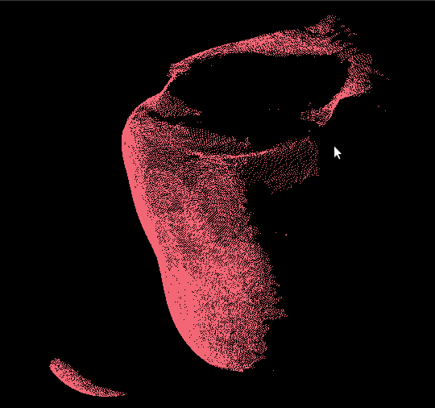
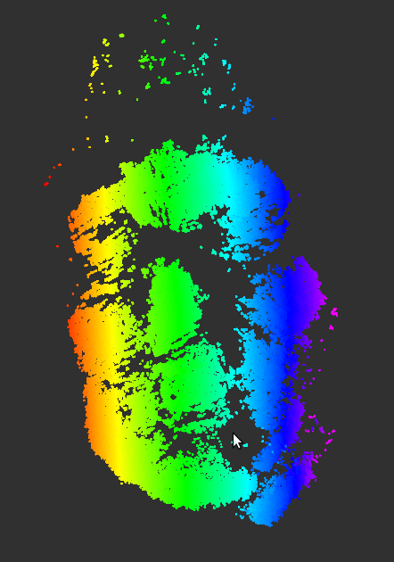
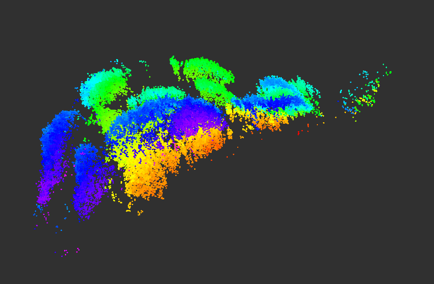
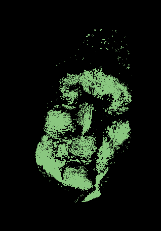
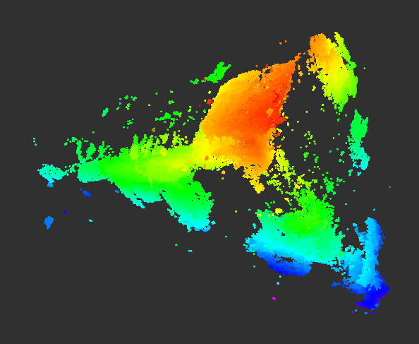

# Introduction

## What is soft tactile sensing?
Soft Sensing is an emerging field in robotics related to the design of robotics sensors that deform elastically when interacting with the physical environment. For our project, we were given access to a soft tactile sensor (STS) made by Isabella Huang that provided us with point cloud data upon which we could infer force, pressure, and topographical information from an object.

## Why is it useful?
We believ that for measuring the shape and surface of an object, this type of soft tactile sensing offers many advantages compared to traditional sensing techniques. For one, it allows for much more detailed readings compared to traditional vision, which can often be unreliable and overly dependent on the environmental factors, such as camera calibration and lighting. It also allows for a softer approach to more delicate tasks, such as interacting with people or handling breakable objects. 

## What is the goal of our project?
The goal of our project is to leverage those advantages and develop a system that takes in repeated measurements from the soft tactile sensor to generate a point cloud reconstruction of the surface of an object. This point cloud data could then be used for further analysis beyond surface reconstruction, such as object detection or facial recognition (if the sensor is used to reconstruct the surface of a human face). 

 

# Design

## Criteria
The original goal of our project was to use a robot (preferably a Sawyer, due to its more accurate movement) with the STS attached to the end effector to gather point cloud measurements one at a time, gradually building up a visualization of the entire surface of the object. This not only allows for more accurate readings of the transform between the global reference frame and the sensor itself (data that is needed to accurately build up a visualization of the object, as described in the Implementation section), but also allows for a more stable and consistent measuring process. 

## Our Final Design
Our final design, unfortunately did not leverage robotic control of the sensor. It involved a person holding the STS and moving it around gathering measurements of the object by hand, gradually building up a visualization of the object in only one viewing angle.

## Decisions, Tradeoffs, and their Impacts
Unfortunately, we were unable to use a Sawyer robot to manipulate the STS. Using a robot would have allowed for a more consistent measuring process and more accurate transform readings between the global frame and the STS. However, as a final test, we wanted to try measuring the surface of a human face, in which case, the use of a robot would be unnecessarily dangerous. Nevertheless, not using a robot in the measurement gathering process allowed for other advantages. With the flexibility of this measurements process we were also able to fine tune and add additional measurements in sparse areas of the final point cloud visualization if we deemed it necessary. Additionally, not having to deal with the actuation of the robot allowed for extra time working on the software portion of the project (documented in the Implementation section of the website).

However, not working with the Sawyer also meant we would have to gather transform data on the sensor using other methods. We decided that the best way to accomplish this was to attach an Augmented Reality(AR) Tag to the back of the STS, which we could then use coupled with a camera to track the coordinate frame of the STS. Unfortunately, however, this meant that we would only be allowed to reconstruct the surface of the object from one viewing angle, as we only had access to one camera with which to track the AR tag.

 

# Implementation

## Materials and Libraries
* Soft Tactile Sensor (STS)
This sensor was developed by Isabella Huang and is made up of a base, a membrane, and a depth camera housed within the sensor behind the membrane. The camera streams in point cloud data of the membrane, allowing it to track for deformities, which provide the data necessary to analyze pressure, force, or topographical measurements. The point cloud data output by the sensor is an organized 2d array with depth measurements.

* Augmented Reality (AR) Tags
These are simple orientation-dependent markers printed on paper. They can be used with a camera and software to track the orientation and position of the paper and whatever it is attached to.

* Camera
We used a camera in conjunction with the AR Tags to track the orientation of the STS.

* ar_track_alvar, usb_cam, and tf2 Packages
These are ROS packages used to feed in raw image data from the camera(usb_cam) and then track the Augmented Reality tags(ar_track_alvar). This is then used to stream transform data to ROS(tf2), which provides us with orientation and position information on the AR tag. (Links to the packages are provided here: [ar_track_alvar](http://wiki.ros.org/ar_track_alvar), [usb_cam](http://wiki.ros.org/usb_cam), and [tf2](http://wiki.ros.org/tf2))

* Point Cloud Library (PCL)
This is an open source library in development used to analyze and manipulate ordered or unordered point cloud data. (Here is a link to their webpage: [PCL](http://www.pointclouds.org/))

## Step 1: Buffering
[Link to Code](https://github.com/calhwd15508/SoftTactileSensing/blob/master/src/model2/src/buffer.py) 
The first step to building up the final point cloud visualization of the object is to buffer the incoming data streamed in from the camera within the STS. We do this by writing a ROS node that waits for input from the user. When this input is received, we take in the point cloud measurement from the stream at that instant. This buffering process allows us to control the speed at which the measurements are being recorded as well as decrease the amount of time and computational power it takes to process the point clouds (so we do not have to process every incoming point cloud, only the ones being streamed in at the time of capture). Additionally, it allows us to synchronize the feeding in of point cloud data with the feeding in of transform data from the AR tag. These need to be properly synched to get the correct position and orientation of the point cloud relative to a global frame at the time of capture.

## Step 2: Cropping
[Link to Code](https://github.com/calhwd15508/SoftTactileSensing/blob/master/src/model2/src/crop.cpp) 
The next step is to take the buffered data and only extract the points from the point cloud that indicated regions of contact with the object. We do this by performing point by point convexity analysis on the points. Given a point, we first find the four neighboring points. The offset from the original point that generates these neighbors can be tuned. For the size of our sensor, we found that 15 was a good offset value that balanced being too sensitive to noise and being too far apart to provide accurate convexity. Given the x-neighbors(2 neighboring points in the x-dimension) and y-neighbors, we find the normals of all of these neighboring points. We then find the curvature signal of the x-neighbors and the y-neighbors separately, which is the dot product of the difference between two points and the difference between their normals. We can find the normals of all of the points in a point cloud using the Point Cloud Library's Normal Estimation algorithm ([Link](http://pointclouds.org/documentation/tutorials/normal_estimation.php)). If this curvature signal is less than 0 in either x or y direction, we know that the original point was convex, and should therefore be classified as a membrane-to-object contact point. A mathematical basis for this algorithm can be found in this paper by Isabella Huang, Jingjun Liu, and Ruzena Bajcsy: [Link to Paper](https://ieeexplore.ieee.org/document/8793612).

In addition to this convexity calculation, we also implemented a simpler check to see if the membrane was deformed at all on a point that was to be classified as "in contact". This is done to rid the resulting cropped point cloud data of some of the noise (where convexity calculations produced false positives). We first grab a point cloud measurement of an undeformed membrane and compare against each subsequent buffered point cloud measurement to see if there is a great difference in the depth measurement. If there was not, we could then be sure that, regardless of the convexity of the point, it was not in contact with the object.

## Step 3: Transforming
[Link to Code](https://github.com/calhwd15508/SoftTactileSensing/blob/master/src/model2/src/transform.py) 
The next step after cropping the point cloud data is to transform it to the correct position and orientation with respect to a global reference frame. In our design, we have a total of four coordinate frames: the camera, the AR tag, the camera inside of the STS, and the membrane. We picked the camera to be the global reference frame. As the only coordinate frame to be static the entire measurement procedure, it was the most natural choice. In order to get the transform between the membrane (which is where the point cloud data is attached to), we need transforms between each of the other frames. Given with the software of the STS is a static transform between the membrane and the camera inside the STS. Using the ROS packages listed above, we are able to obtain a transform between the global reference frame (the camera) and the AR tag. Since we have the AR tag taped onto the back of the sensor, we have an accurate static transform between the AR tag and the sensor itself. Now that we have a fully defined transform between the membrane and a global reference frame, we write a ROS node to transform the cropped point cloud data to the correct position and orientation.

## Step 4: Aggregating
[Link to Code](https://github.com/calhwd15508/SoftTactileSensing/blob/master/src/model2/src/concatenate.cpp) 
Then, after transforming the point cloud, all we need to do is to aggregate them together into one total point cloud, which, if cropped and transformed properly, should provide an accurate reconstruction of a surface of an object. We do this simply by writing a ROS node and using the Point Cloud Library to concatenate all of the point clouds together.

## Step 5: Smoothing
[Link to Code](https://github.com/calhwd15508/SoftTactileSensing/blob/master/src/model2/src/smoothing.cpp) 
The final step is to smooth out the aggregated point cloud data. We do this by using the Point Cloud Library's Moving Least Squares smoothing filter ([Link](http://pointclouds.org/documentation/tutorials/resampling.php)) to resample noisy data across the point cloud. Finally, we display the final smoothed point cloud using the PCL's Point Cloud Visualizer (it can also be seen on RViz).

 

# Results
[Video](https://www.youtube.com/watch?v=xyMRvhR-1Hc&list=UUashrjAFw0vfYBrV5bwDyPA) 
Our system was able to reconstruct the surface of the following objects with reasonable accuracy:

## Soup Can

## Martinelli Bottle

## David's Face

# Conclusion

## Difficulties
When we tried measuring the surfaces of flat objects, we found that the resulting point cloud was very sparse. We realized that this is because our cropping algorithm assumes stricly convex surfaces, so a flat surface would have a curvature signal around 0 and likely get cropped out. This was very apparent when we tried to measure the surface of a cube. 

## Potential Improvements
As described above, one of the lackluster surface reconstruction results was of the surface of a cube. We hypothesize that this is due to the flat nature of the faces of the cube. As documented in the Cropping section of our Implementation, the system crops out points which are not convex. While flat surfaces are convex they are not strictly so. Our current algorithm simply checks to see if the curvature signal is greater than or equal to 0. As a result, any noise in the depth reading or normal estimation will result in the curvature being less than 0, and it being cropped out. To fix this, we could implement some threshold around 0 and keep these points during our cropping stage to account for flat surfaces such as the cube. The exact threshold itself would be a parameter that would need to be tuned in order to allow for points on flat surfaces yet still filter out concave non contact points.

Another limitation of the project is that it is only able to reconstruct a single face of an object. This is because we were limited to one tracking camera, and the AR tag on the back of our sensor had to be visible to the camera during the measurements, thus forcing our sensor to always be pointed away from the camera. A solution to this would be to have a group of cameras surrounding the object, each with a static transform to a global reference camera. This way, at any given point, the AR tag will be in view of at least one camera. In addition, if multiple cameras are able to recognize the AR tag, we can average the calculated orientation of the AR tag to produce a more noise robust transformation to the global reference frame. This would allow us to reconstruct full objects in their entirety. 

 

# Team Members

## David Deng
David Deng is a currently a junior Undergraduate studying EECS at UC Berkeley. He has taken courses in both Computer Science and Electrical Engineering and has a background in signals and machine learning. He is currently doing research on using deep learning models to analyze point clouds. David and Howard worked closely together on all parts of the project; however, David contributed more to managing the hardware and recording measurements. 

## Howard Zhang
Howard Zhang is currently a junior Undergraduate studying EECS at UC Berkeley. He has taken courses in both Computer Science and Electrical Engineering and has a background in Signals and Systems (EE120, EE123) and MEMS (EE147). He has extensive experience in robotics and programming from both high school and college projects that he has worked on in the past. David and Howard worked closely together on all parts of the project; however, Howard contributed more to implementing the software. 

